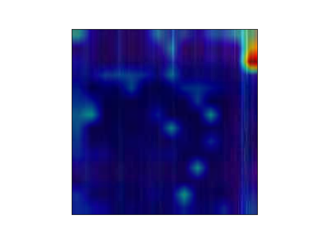
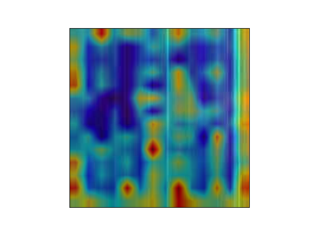

# Result

|          | Precision | Recall  | F1 score |
| -------- | --------- | ------- | -------- |
| ViT      | 0.70827   | 0.71688 | 0.71254  |
| VGG      | 0.53791   | 0.32882 | 0.40814  |
| Resnet   | 0.68719   | 0.61265 | 0.64778  |
| GooLeNet | 0.69515   | 0.55869 | 0.61949  |

# Dataset

数据为244x244的热力学图。

横坐标为频域范围为0-32768，纵坐标为取样的时间切片范围为0-10，然后resize成224x224

​											工况1_2，情况：坏

​											工况1_2，情况：好

# Attention-ViT可解释性

​											工况1_2，情况：坏

​											工况1_2，情况：好

